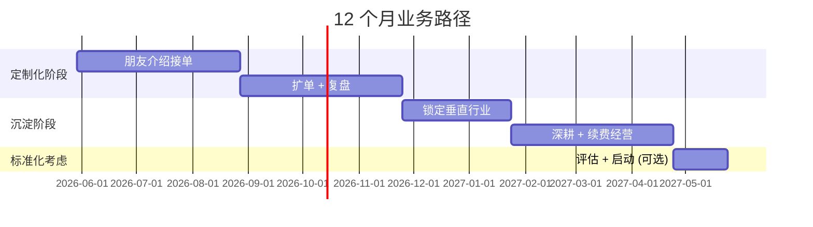

# 🛤️ 定制化 vs 标准化路径

> [!warning] 核心决策
> **两个都能做但有严格先后顺序**, 同时做基本两边都崩.
> **先纯定制 6-12 个月, 标准化是定制的副产品**.

---

## ⚖️ 两种模式的本质差异

| 维度 | 定制化 | 标准化 SaaS |
|---|---|---|
| **单价** | 5-30 万一单 | 几百-几千 / 月 |
| **毛利** | 40-60% | 80%+ |
| **销售半径** | 你认识的人 | 互联网全域 |
| **销售方式** | 1 对 1 走访 + 顾问 | 内容 / 广告 / SEO |
| **现金流** | 当月正向 | 先烧 6-18 个月 |
| **天花板** | 你的时间 | 市场规模 |
| **第一个客户怎么来** | **朋友介绍 ✅** | 短视频 / SEO / 付费 |

> [!success] 当前条件分析
> 朋友介绍 + 后端降本增效 = **100% 适配定制化, 0% 适配 SaaS**.

---

## ❌ 为什么不能直接做标准化?

> [!danger] 标准化的本质
> 标准化产品的本质是"**高频同质痛点的工程化封装**". 你刚起步, 根本不知道"哪个痛点会在 10 个客户里出现 8 次, 哪个只是某个老板的特殊需求".

凭直觉做出来的标准化产品 **95% 会扑街**. 唯一可靠路径:

```
做 10-15 个定制项目
   ↓
看哪 1-2 个痛点重复出现 ≥ 5 次
   ↓
那个才是值得抽出来标准化的
```

**飞书 / 钉钉 / 法大大** 都是从定制业务里长出来的, 不是先想清楚再做.

---

## 🚦 标准化上车 3 个信号 (达到再启动, 不要早)

> [!info] 上车信号
> 1. **同一类型痛点已经做过 ≥ 5 个定制客户**, 你能闭着眼睛画出标准化方案
> 2. **至少 3 个老客户问过**: "这个能不能给我们公司也开通一下, 我朋友也想用" — 自然增长信号
> 3. **你有 6-12 个月不靠 SaaS 现金流也能活的钱** — 因为 SaaS 启动到盈利至少 1 年

满足这 3 条之前都别碰标准化. **闷头做定制**, 现金流稳, 客户认知积累, 6 个月后自然会看见标准化机会.

---

## 🗓️ 推荐的 12 个月路径



| 阶段 | 月份 | 关键动作 | 目标 |
|---|---|---|---|
| 🚀 起步 | 1-3 | 朋友圈接 3-5 单, 5-15 万/单 | 学坑, 摸真实痛点 |
| 📈 扩单 | 4-6 | 累计 8-10 单, 看哪个行业重复 | 锁定垂直方向 |
| 🎯 深耕 | 7-9 | 选定垂直, 单价拉到 10-15 万 | 续费率开始爬升 |
| 🏆 复利 | 10-12 | 12-15 单, 续费率 ≥ 50% | 考虑标准化 |

---

## 💡 关键认知

> [!tip] 同时做两个的死法
> **做 SaaS 那部分**会因为没流量停留在 demo 状态
> **做定制那部分**会因为想留时间做 SaaS 而服务质量下滑
> **结果**: 两边都做不好, 6 个月后两个都死.

> [!success] 闷头做定制的收益
> - 现金流当月正向, 不焦虑
> - 客户认知积累, 6 个月后看见行业全貌
> - 沉淀的客户物料 = 标准化产品的种子
> - 即使永远不做标准化, 定制化也能做到 50-100 万/月稳定收入

---

## 🔗 关联文档

- [[01-市场定位与5层玩家]]
- [[06-销售凭据5件套]]
